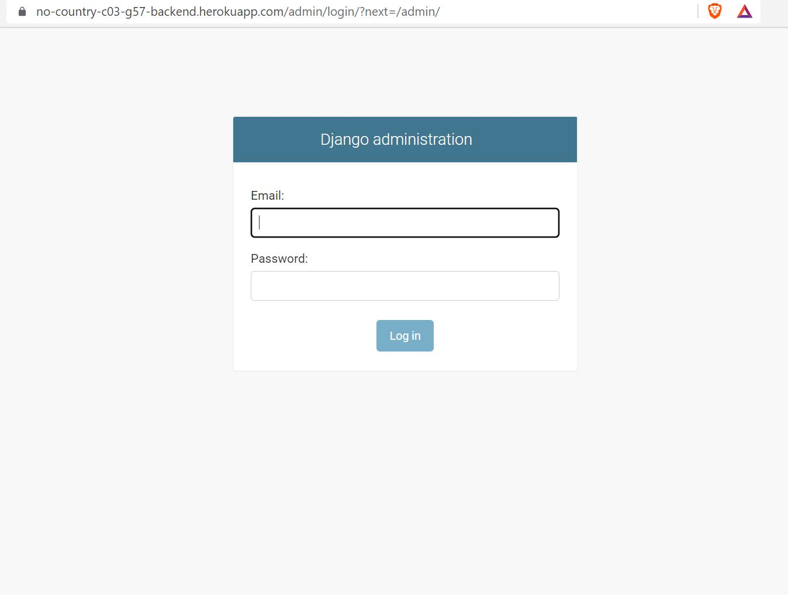
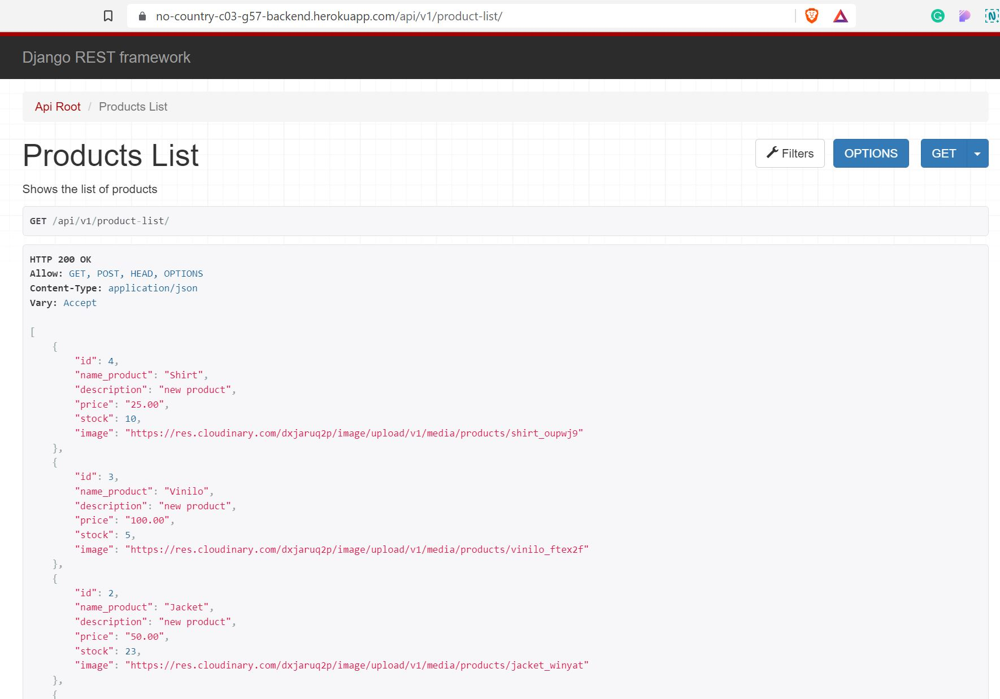

# Dualipa Events

### Here you'll find the latest tickets, products and memorabilia of her shows:


---
## How to login to the backend admin panel

## What can you do with it:

## What do you get in return:


---

## Tech stack:
### Frontend:
* HTML 5 for document structure
* CSS 3 - Bootstrap 5 for styling
* Javascript ES6+ - React 17 & Redux 4.1 (SPA)
* NodeJs & npm/yarn for the development environment
### Backend:
* Python 3.9 - Django 3.2 (django-rest-framework 3.13)
* Postgresql for the database
## Hosting:
* Heroku for deployment itself
* Cloudinary for image storage
## Project management:
* Scrum as agile methodology
* Trello for project management
* Git and Github for version control

---
## Contributors:
Team who participated in this project.
* [Gordon Mario](https://github.com/maegop) - Backend
* Muñoz Gonzalo - Fullstack
* Rojas Massey Luca - Frontend
* Scalzo Bryan - Frontend
* Vargas Eva - Frontend and team coordinator

---
## Where can you find us?
### [Backend server](https://no-country-c03-g57-backend.herokuapp.com/api/v1/product-list)
### [Working website](http://no-country-c03-g57-frontend.herokuapp.com/)
---
## Getting started with the project:
The following instructions will get you a copy of the project up and running on your local machine for development purposes. 
You'll need to do a couple of things in order to run this project on your local machine:

1) Clone both backend and frontend servers:
```sh
git clone https://github.com/No-Country/C3-G45-backend.git
git clone https://github.com/No-Country/C3-G45.git
```

2) Install dependencies:
```sh
# For backend
cd C3-G45-backend
pip install -r requirements.txt
```
```sh
# For frontend
cd C3-G45
npm install # or yarn install
```

3) Run the backend server:
```sh
python3 manage.py makemigrations  # Create migrations
python3 manage.py migrate         # Apply migrations
python3 manage.py createsuperuser # Pick whatever user and password you want
python3 manage.py runserver       # This is a development server
```
4) Run the frontend server:
```sh
npm start # or yarn start
```

5) Open the frontend in your browser:
```sh
http://localhost:3000
```

---
## Acknoledgements:
* The whole No Country staff
* A bunch of other people I will mention later :)
